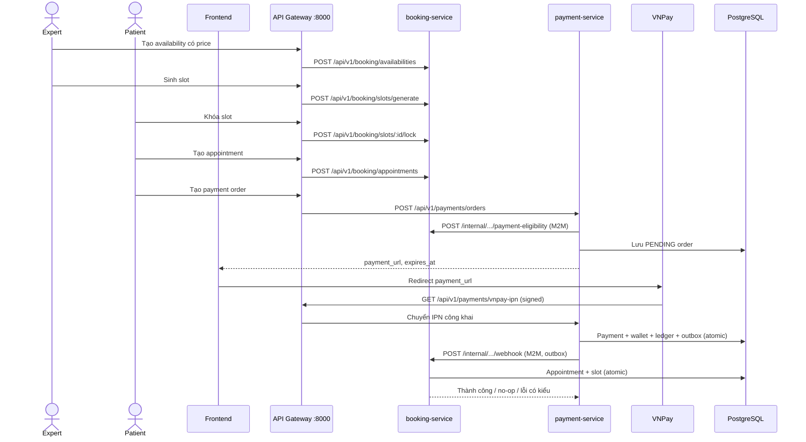

# Hướng dẫn tích hợp Booking và Payment API

> Phạm vi: môi trường local dùng `docker-compose.dev.huy.yml`, xác minh thực tế ngày 19/07/2026. Các UUID và token trong ví dụ đã được thay thế. Frontend chỉ gọi qua API Gateway.

## 1. Tổng quan luồng

Chuyên gia tạo mẫu thời gian và lịch rảnh có giá -> hệ thống sinh slot -> bệnh nhân khóa slot -> tạo appointment -> tạo payment order -> chuyển trình duyệt sang VNPay -> VNPay gọi IPN -> payment-service ghi payment, ví và outbox trong một transaction -> outbox gọi booking-service bằng REST nội bộ -> appointment được xác nhận hoặc hủy.



## 2. Base URL và authentication

- API Gateway local: `http://localhost:8000`.
- Login: `POST /api/v1/auth/login`.
- API riêng tư: `Authorization: Bearer <ACCESS_TOKEN>`.
- Token mẫu: `<ADMIN_ACCESS_TOKEN>`, `<EXPERT_ACCESS_TOKEN>`, `<PATIENT_ACCESS_TOKEN>`.
- Kong xác minh JWT và **ghi đè** `X-User-Id`, `X-User-Role`, `X-User-Email`. Frontend không được tự đặt và không được tin các header này.
- `/internal/*` bị Kong chặn bằng HTTP `403`.
- `payment-service` và `booking-service` không publish cổng ra host trong Compose; đường frontend bình thường chỉ qua Kong.

## 3. Test accounts

### Local Development Only

| Role | Email | Password |
|---|---|---|
| ADMIN | `admin@mindcare.com` | `admin@mindcare.com` |
| EXPERT | `expert@mindcare.com` | `expert@mindcare.com` |
| PATIENT | `patient@mindcare.com` | `patient@mindcare.com` |

Không sử dụng các tài khoản này trong production.

## 4. Common response envelope

Auth trả envelope riêng với token dạng camelCase:

```json
{
  "success": true,
  "message": "Login successful!",
  "data": {
    "accessToken": "<PATIENT_ACCESS_TOKEN>",
    "accountId": "11111111-1111-4111-8111-111111111111",
    "fullName": "John Patient",
    "refreshToken": "<REDACTED>",
    "role": "PATIENT"
  }
}
```

Booking và Payment dùng:

```json
{"success":true,"message":"...","data":{}}
```

Lỗi dùng:

```json
{"success":false,"message":"...","error":"..."}
```

`data` và `error` có thể bị bỏ khỏi JSON khi rỗng. VNPay IPN là ngoại lệ, dùng `{ "RspCode": "00", "Message": "Confirm Success" }`.

## 5. Authentication APIs

### Đăng nhập

- Method/route: `POST /api/v1/auth/login`.
- Role: public.
- Header: `Content-Type: application/json`.
- Request:

```json
{"email":"patient@mindcare.com","password":"patient@mindcare.com"}
```

- Thành công: HTTP `200`, response như mục 4.
- Sai thông tin: HTTP `401` theo auth-service.
- Frontend lấy `data.accessToken` cho Bearer header. Không log token; cơ chế lưu token cần tuân theo chính sách bảo mật của frontend.

## 6. Booking APIs

### Danh sách time template

- `GET /api/v1/public/booking/templates`, public.
- Request body: không có.
- Runtime response:

```json
{
  "success": true,
  "message": "Get shift templates successfully",
  "data": [{
    "TemplateID": "aaaaaaaa-aaaa-4aaa-8aaa-aaaaaaaaaaaa",
    "ShiftName": "Ca Sáng (08h-12h)",
    "StartTime": "08:00",
    "EndTime": "12:00",
    "SlotDurationMinutes": 60,
    "IsActive": true
  }]
}
```

Lưu ý: các key của template hiện là PascalCase đúng theo runtime.

### Tạo time template

- `POST /api/v1/booking/templates`, ADMIN.
- Header: Bearer ADMIN.
- Request:

```json
{"shift_name":"Ca tối","start_time":"18:00","end_time":"21:00","slot_duration_minutes":30}
```

- Thành công `200`: `message = "Shift template created successfully!"`, `data` là template PascalCase.
- `400`: JSON/binding hoặc cấu hình thời gian sai. `403`: không phải ADMIN. `409`: chồng lấn khi rule áp dụng.
- Thời gian phải là `HH:mm`; duration từ 10 đến 180 phút; start phải trước end.

### Bật/tắt time template

- `PATCH /api/v1/booking/templates/:id`, ADMIN.
- Request: `{"is_active":false}`.
- Thành công:

```json
{"success":true,"message":"Template updated successfully","data":{"id":"aaaaaaaa-aaaa-4aaa-8aaa-aaaaaaaaaaaa","is_active":false}}
```

Không có endpoint xóa template.

### Tạo expert availability có giá

- `POST /api/v1/booking/availabilities`, EXPERT.
- Request:

```json
{
  "template_id":"aaaaaaaa-aaaa-4aaa-8aaa-aaaaaaaaaaaa",
  "day_of_week":2,
  "effective_from":1784394000000,
  "effective_until":null,
  "price":300000
}
```

- `day_of_week`: 1=Thứ Hai ... 7=Chủ Nhật.
- `price`: VND nguyên, dương; là nguồn giá có thẩm quyền khi sinh slot.
- Thành công:

```json
{
  "success":true,
  "message":"Availability configuration registered successfully!",
  "data":{
    "availability_id":"bbbbbbbb-bbbb-4bbb-8bbb-bbbbbbbbbbbb",
    "expert_id":"22222222-2222-4222-8222-222222222222",
    "template_id":"aaaaaaaa-aaaa-4aaa-8aaa-aaaaaaaaaaaa",
    "day_of_week":2,
    "is_enabled":true,
    "effective_from":1784394000000,
    "effective_until":null,
    "price":300000
  }
}
```

- Availability trùng ngày, khoảng hiệu lực và khung giờ trả `409` với `message = "Schedule configuration overlaps"`.

### Danh sách availability của expert

- `GET /api/v1/booking/availabilities`, EXPERT.
- Thành công `200`: `data` là mảng availability giống schema trên.

### Cập nhật availability

- `PATCH /api/v1/booking/availabilities/:id`, EXPERT sở hữu.
- Body nhận các field tùy chọn: `template_id`, `day_of_week`, `is_enabled`, `effective_from`, `effective_until`, `price`.
- Ví dụ: `{"price":310000}`.
- Thành công:

```json
{"success":true,"message":"Availability updated successfully","data":{"id":"bbbbbbbb-bbbb-4bbb-8bbb-bbbbbbbbbbbb","updates":{"price":310000}}}
```

- Chỉ slot tương lai `AVAILABLE`, đúng availability/expert và không có appointment mới được reconcile. `LOCKED`, `OCCUPIED`, `UNAVAILABLE` và slot có appointment được bảo vệ.
- Hiện **không có endpoint xóa availability**; dùng `is_enabled:false` nếu phù hợp nghiệp vụ.

### Sinh slot thủ công

- `POST /api/v1/booking/slots/generate`, EXPERT.
- Request: `{"days_to_generate":30}` (1..30).
- Thành công:

```json
{"success":true,"message":"Slots generated successfully!","data":{"expert_id":"22222222-2222-4222-8222-222222222222","slots_created":128}}
```

- Gọi lại là idempotent; runtime trả `slots_created: 0` nếu không có slot mới.
- Slot sinh ra giữ `availability_id` và snapshot `price`.

### Ngày còn slot

- `GET /api/v1/public/booking/slots/available-dates?expert_id=:expertId`, public.
- Thành công:

```json
{"success":true,"message":"Get available dates successfully","data":{"expert_id":"22222222-2222-4222-8222-222222222222","available_dates":["2026-07-21"]}}
```

### Giờ còn slot

- `GET /api/v1/public/booking/slots/available-times?expert_id=:expertId&date=YYYY-MM-DD`, public.
- Thành công:

```json
{
  "success":true,
  "message":"Get available timeslots successfully",
  "data":{
    "expert_id":"22222222-2222-4222-8222-222222222222",
    "date":"2026-07-21",
    "available_times":[{"slot_id":"cccccccc-cccc-4ccc-8ccc-cccccccccccc","start_time":1784595600000,"end_time":1784597400000}]
  }
}
```

Chỉ trả slot `AVAILABLE`, tương lai và không bị time-off bao phủ.

### Danh sách slot của expert

- `GET /api/v1/booking/slots/expert?from_date=:unixMs&to_date=:unixMs`, EXPERT.
- Query là tùy chọn.
- `data.slots[]` có: `slot_id`, `expert_id`, `date_slot`, `start_time`, `end_time`, `status`, `status_label`, `price`, `locked_expires_at`, `locked_by`, `availability_id`, `created_at`, `updated_at`.

### Khóa slot

- `POST /api/v1/booking/slots/:id/lock`, PATIENT; không có body.
- Thành công:

```json
{"success":true,"message":"Slot locked successfully. You have 15 minutes to complete the booking.","data":{"expires":900,"slot_id":"cccccccc-cccc-4ccc-8ccc-cccccccccccc"}}
```

- Transition: `AVAILABLE -> LOCKED`; lưu `locked_by` và `locked_expires_at`.
- Slot đã khóa đồng thời trả `409`. Slot time-off/không khả dụng không thể khóa.

### Tạo appointment

- `POST /api/v1/booking/appointments`, PATIENT.
- Request:

```json
{"slot_id":"cccccccc-cccc-4ccc-8ccc-cccccccccccc","expert_id":"22222222-2222-4222-8222-222222222222"}
```

- Thành công:

```json
{"success":true,"message":"Appointment created successfully! Please complete payment within 15 minutes.","data":{"appointment_id":"dddddddd-dddd-4ddd-8ddd-dddddddddddd","slot_id":"cccccccc-cccc-4ccc-8ccc-cccccccccccc","status":0}}
```

- Slot phải đang `LOCKED`, thuộc patient hiện tại, đúng expert và lock chưa hết hạn. Appointment bắt đầu `PENDING_PAYMENT` (0).

### Danh sách appointment của patient

- `GET /api/v1/booking/appointments`, PATIENT.
- Hỗ trợ `from`, `to`, `status`, `expert_id`, `page`, `size`; mặc định 30 ngày và `page=0&size=20`.
- Thành công: `data.items[]` và alias tương thích `data.appointments[]`, cùng metadata phân trang.
- Mỗi item có thêm `start_time`, `end_time` và giá snapshot của slot.
- Đây là API frontend hiện có để kiểm tra kết quả booking sau khi từ VNPay quay về.

### Danh sách appointment của expert

- `GET /api/v1/booking/appointments/expert?from=2026-07-01&to=2026-07-30&status=CONFIRMED&page=0&size=20`, EXPERT.
- `from_date`/`to_date` Unix ms cũ vẫn được chấp nhận khi không truyền `from`/`to`.
- Response giống danh sách patient.

### Chi tiết appointment

`GET /api/v1/booking/appointments/:id` dành cho PATIENT sở hữu, EXPERT được phân công, hoặc ADMIN. Người không liên quan nhận `403`. `GET /internal/appointments/:id` vẫn chỉ dành cho payment-service.

### Hủy appointment

- `PATCH /api/v1/booking/appointments/:id/cancel`, PATIENT sở hữu hoặc EXPERT liên quan.
- Request: `{"reason":"Không thể tham gia"}`.
- Thành công:

```json
{"success":true,"message":"Appointment cancelled successfully","data":{"appointment_id":"dddddddd-dddd-4ddd-8ddd-dddddddddddd"}}
```

- Transition và slot phụ thuộc trạng thái/time-off. Lỗi nghiệp vụ hiện có thể được handler trả `500`; frontend phải hiển thị thông báo an toàn và không tự suy đoán trạng thái.

### Tạo time-off

- `POST /api/v1/booking/time-off`, EXPERT.
- Request:

```json
{"start_datetime":1784595600000,"end_datetime":1784597400000,"reason":"Nghỉ đột xuất"}
```

- Thành công trả `data.time_off` gồm `time_off_id`, `expert_id`, `start_datetime`, `end_datetime`, `reason`, `processed_at`.
- Nếu có booking được bảo vệ, trả `409`; không tự hủy booking đã CONFIRMED/OCCUPIED.

### Force-confirm time-off

- `POST /api/v1/booking/time-off/confirm`, EXPERT.
- Body giống tạo time-off.
- Chỉ có thể hủy các appointment `PENDING_PAYMENT`; conflict với CONFIRMED/OCCUPIED vẫn trả `409`.
- Slot được bao phủ trở thành `UNAVAILABLE`; callback payment FAILED sau đó là no-op idempotent và không mở slot thành AVAILABLE.

### Danh sách và xóa time-off

- `GET /api/v1/booking/time-off`, EXPERT: trả `data.time_offs`, `data.total`.
- `DELETE /api/v1/booking/time-off/:id`, EXPERT sở hữu.
- Xóa thành công:

```json
{"success":true,"message":"Time-off deleted successfully","data":{"time_off_id":"eeeeeeee-eeee-4eee-8eee-eeeeeeeeeeee"}}
```

- Appointment đã hủy không được phục hồi. Hệ thống có thể sinh lại các slot an toàn sau đó.

## 7. Payment APIs

### Tạo payment order

- `POST /api/v1/payments/orders`, PATIENT.
- Request duy nhất có thẩm quyền:

```json
{"appointment_id":"dddddddd-dddd-4ddd-8ddd-dddddddddddd"}
```

- `payer_id` lấy từ JWT/Kong; `expert_id`, amount và deadline lấy từ payment eligibility của booking-service. Các field legacy từ client không có thẩm quyền.
- Thành công runtime:

```json
{
  "success":true,
  "message":"Payment order created successfully",
  "data":{
    "order_id":"ffffffff-ffff-4fff-8fff-ffffffffffff",
    "gross_amount":300000,
    "net_amount":255000,
    "commission_amount":45000,
    "payment_url":"https://sandbox.vnpayment.vn/paymentv2/vpcpay.html?<SIGNED_QUERY>",
    "status":"PENDING",
    "expires_at":1784444718000
  }
}
```

- Gọi lại khi còn PENDING trả cùng order ID, txn reference và expiry; không tạo row thứ hai.
- Order hết hạn tại `now >= expires_at`; lần gọi sau revalidate booking và tạo replacement nếu lock còn hợp lệ.
- Appointment đã SUCCESS trả `409`; booking hết cửa sổ trả `409`.

### VNPay redirect

Frontend chuyển trình duyệt trực tiếp đến `data.payment_url`. Không tính amount, không thêm/bớt/sửa query VNPay. `vnp_ExpireDate` được sinh từ đúng `expires_at` đã lưu.

### VNPay return URL

Compose cấu hình local: `http://localhost:3000/payment-result`. Frontend có thể nhận các query như `vnp_TxnRef`, `vnp_Amount`, `vnp_ResponseCode`, `vnp_TransactionNo`, `vnp_PayDate`, `vnp_SecureHash`.

Các query return chỉ phục vụ hiển thị tạm thời. Frontend **không** đánh dấu thành công chỉ dựa vào return URL; IPN đã ký và trạng thái backend mới là nguồn sự thật.

### Payment status/detail API

- `GET /api/v1/payments/orders/:id`, PATIENT sở hữu hoặc ADMIN: đọc `status`, `fulfillment_status`, `gateway_capture_status`, `expires_at` và amount an toàn.
- `GET /api/v1/payments/orders?appointment_id=<UUID>&status=SUCCESS&fulfillment_status=BOOKING_CONFIRMED&from=2026-07-01&to=2026-07-30&page=0&size=20`, PATIENT: chỉ trả order của chính người dùng.
- Frontend nên poll order detail sau VNPay return, đồng thời poll appointment để hiển thị trạng thái fulfillment cuối cùng. Response read không chứa secure hash, raw IPN hay secret và không trả URL đã hết hạn.

### Compensation admin APIs

- `GET /api/v1/payments/compensation-cases`, ADMIN.
- Filter tùy chọn: `status`, `reason_code`, `appointment_id`, `payment_order_id`, `from`, `to`, `page`, `size` (zero-based, tối đa 100).
- Response:

```json
{
  "success":true,
  "message":"Compensation cases retrieved successfully",
  "data":{"items":[{
    "id":"99999999-9999-4999-8999-999999999999",
    "payment_order_id":"ffffffff-ffff-4fff-8fff-ffffffffffff",
    "appointment_id":"dddddddd-dddd-4ddd-8ddd-dddddddddddd",
    "type":"BOOKING_FULFILLMENT",
    "status":"REFUND_REQUIRED",
    "payment_status":"SUCCESS",
    "money_paid":true,
    "gateway_capture_status":"CAPTURED",
    "fulfillment_status":"REFUND_REQUIRED",
    "gateway_order_reference":"ffffffff-ffff-4fff-8fff-ffffffffffff",
    "gateway_transaction_number":"<SAFE_GATEWAY_REFERENCE>",
    "gateway_response_code":"00",
    "gateway_transaction_status":"00",
    "gateway_payment_date":"20260719100000",
    "reason_code":"BOOKING_CONFLICT",
    "safe_reason":"Booking cannot be confirmed because it is already in an opposite terminal state.",
    "amount_vnd":300000,
    "created_at":1784445000000,
    "updated_at":1784445000000
  }],"total":1,"total_items":1,"total_pages":1,"has_next":false,"has_previous":false,"page":0,"size":20}
}
```

- `GET /api/v1/payments/compensation-cases/:id`, ADMIN: cùng item schema.
- PATIENT/EXPERT bị `403`. Response không chứa secure hash, chữ ký hay secret.

### Wallet và withdrawal phụ trợ

- `GET /api/v1/payments/wallets/me`, PATIENT/EXPERT: số dư `available_balance`, `pending_balance`, `locked_balance`.
- `GET /api/v1/payments/wallets/history?type=PAYMENT_RECEIVED&direction=CREDIT&from=2026-07-01&to=2026-07-30&page=0&size=20`, PATIENT/EXPERT: ledger phân trang, mặc định 30 ngày và mới nhất trước.
- `POST /api/v1/payments/wallets/top-up`, PATIENT/EXPERT, body `{"amount":100000}`: **dev/test only**, không phải VNPay top-up.
- `POST/GET /api/v1/payments/bank-accounts` quản lý danh sách tài khoản ngân hàng hiện có; chưa có unlink/default vì model chưa hỗ trợ lifecycle an toàn.
- `GET /api/v1/payments/withdrawals?status=PENDING&page=0&size=20`, EXPERT: danh sách của chính expert.
- `GET /api/v1/payments/withdrawals/:id`, EXPERT sở hữu hoặc ADMIN.
- `GET /api/v1/payments/admin/withdrawals?status=PENDING_APPROVAL&expert_id=<UUID>&page=0&size=20`, ADMIN.

## 8. Status dictionaries

| Nhóm | Giá trị |
|---|---|
| Slot | `0 AVAILABLE`, `1 LOCKED`, `2 OCCUPIED`, `3 UNAVAILABLE` |
| Appointment | `0 PENDING_PAYMENT`, `1 CONFIRMED`, `2 CANCELLED` |
| Payment order | `1 PENDING`, `2 SUCCESS`, `3 FAILED`, `4 EXPIRED` |
| Fulfillment | `PENDING`, `BOOKING_CONFIRMED`, `BOOKING_FAILED`, `MANUAL_REVIEW`, `REFUND_REQUIRED` |
| Gateway capture | `PENDING`, `CAPTURED`, `FAILED`, `CAPTURED_DUPLICATE` |
| Outbox nội bộ | `PENDING`, `RETRY_WAIT`, `DELIVERED`, `DEAD` |
| Compensation | `MANUAL_REVIEW`, `REFUND_REQUIRED` |
| Compensation reason | `BOOKING_CONFLICT`, `APPOINTMENT_NOT_FOUND`, `BOOKING_AUTHENTICATION_REJECTED`, `BOOKING_DELIVERY_RETRIES_EXHAUSTED`, `BOOKING_CONTRACT_FAILURE`, `DUPLICATE_GATEWAY_CAPTURE` |

Frontend patient chủ yếu thấy appointment status. Fulfillment, capture và compensation chỉ hiện qua API ADMIN; outbox là nội bộ.

## 9. Frontend flow recipes

### Patient đặt lịch và thanh toán

1. Login, lấy Bearer token.
2. Query available dates/times.
3. `POST /slots/:id/lock`.
4. `POST /appointments`.
5. `POST /payments/orders` chỉ với `appointment_id`.
6. Redirect đến `payment_url`.
7. Khi VNPay return, chỉ hiển thị “đang xác minh”.
8. Poll `GET /payments/orders/:id` để đọc payment/fulfillment/capture và `GET /booking/appointments/:id` để đọc booking cuối cùng.
9. Hiển thị confirmed/cancelled/pending; có timeout và nút thử lại an toàn.

### Expert tạo lịch làm việc

1. Login EXPERT.
2. Lấy template public.
3. Tạo availability có `price`.
4. Gọi generate hoặc chờ rolling generation.
5. Query `/slots/expert` và `/appointments/expert`.

### Patient retry payment

- PENDING còn hạn: backend trả lại cùng order.
- PENDING hết hạn: backend expire order cũ, revalidate booking rồi tạo order mới.
- Đã có SUCCESS: backend chặn order mới bằng `409`.
- Không tạo payment từ amount/expert do frontend gửi.

### Frontend xử lý expiry

- So sánh thời gian hiện tại với `expires_at`; không gia hạn phía client.
- Sau expiry, gọi CreateOrder lại; booking lock cũng có thể đã hết nên có thể nhận `409`.
- Không tái sử dụng URL cũ sau expiry.

## 10. HTTP/error handling table

| HTTP | Ý nghĩa thực tế | Frontend nên làm |
|---|---|---|
| 400 | JSON/UUID/status/giá/lịch không hợp lệ | Sửa input, không retry mù |
| 401 | Thiếu/hết hạn JWT | Login/refresh token |
| 403 | Sai role/ownership hoặc internal bị chặn | Không retry; ẩn chức năng |
| 404 | Resource không tồn tại | Refresh danh sách |
| 409 | Slot race, lịch chồng, trạng thái booking/payment conflict | Refresh trạng thái rồi cho chọn lại |
| 429 | Kong rate limit (20/s, 200/phút trong config local) | Backoff có jitter |
| 500 | Lỗi service/repository hoặc một số booking business error legacy | Hiển thị lỗi an toàn, kiểm tra trạng thái trước retry |
| 503 | Kong không có upstream khỏe / service tạm dừng | Retry có backoff; không kết luận payment thất bại |

## 11. Idempotency và retry

- CreateOrder retry trả cùng active PENDING order.
- Duplicate VNPay IPN do backend xử lý; frontend không bao giờ gọi IPN.
- Booking SUCCESS khi đã CONFIRMED và FAILED khi đã CANCELLED là no-op thành công.
- Nút lock/create/pay nên disabled trong lúc request đang chạy.
- Có thể retry GET, lỗi mạng trước khi nhận response, và CreateOrder cho cùng appointment. Với mutation booking khác, refresh state trước.
- Outbox retry nằm trong PostgreSQL và sống qua restart payment-service.

## 12. Internal-only APIs

> **Frontend không được gọi các API này.** Kong chặn `/internal`.

- `POST /internal/appointments/:id/payment-eligibility`
  - Body nội bộ: `{"payer_id":"<TRUSTED_PAYER_UUID>"}`.
  - Trả `appointment_id`, `expert_id`, `amount_vnd`, `expires_at`.
- `POST /internal/appointments/:id/webhook`
  - Body: `{"appointment_id":"...","status":"SUCCESS|FAILED"}`; path ID là nguồn chuẩn.
  - Chỉ caller M2M có `client_id=payment-service`.
- `GET /api/v1/payments/vnpay-ipn?...`
  - Public để VNPay gọi, nhưng phải có HMAC-SHA512 hợp lệ.
  - `00 Confirm Success`, `02 Order already confirmed`, `97 Invalid Signature`, `04 Invalid amount`, `01 Order not found`, `99` cho lỗi khác.
- M2M dùng `Authorization: Bearer <INTERNAL_JWT>`; không công khai shared secret/header nội bộ.

## 13. Complete example journey

Các ID sau hoàn toàn hư cấu:

1. EXPERT tạo availability `bbbbbbbb-bbbb-4bbb-8bbb-bbbbbbbbbbbb`, giá `300000`.
2. Hệ thống sinh slot `cccccccc-cccc-4ccc-8ccc-cccccccccccc`, `availability_id=bbbb...`, `AVAILABLE`.
3. PATIENT khóa slot; slot thành `LOCKED`, expiry 15 phút.
4. PATIENT tạo appointment `dddddddd-dddd-4ddd-8ddd-dddddddddddd`, status `0`.
5. PATIENT tạo order `ffffffff-ffff-4fff-8fff-ffffffffffff`, gross `300000`, expiry không vượt lock.
6. Frontend redirect URL VNPay đã ký, không sửa query.
7. VNPay IPN hợp lệ làm payment `SUCCESS/CAPTURED`; expert pending balance nhận net `255000`, ledger ghi gross `+300000` và commission `-45000` đúng một lần.
8. Outbox DELIVERED; appointment thành `CONFIRMED`, slot thành `OCCUPIED`, fulfillment `BOOKING_CONFIRMED`.
9. Frontend poll payment order detail và appointment detail rồi hiển thị thành công.

## 14. Known limitations

- Chưa có automatic refund; compensation cần ADMIN xử lý thủ công.
- Payment order/status và appointment detail đã có ownership check; frontend không cần tin VNPay return query.
- Availability dùng `PATCH {"is_enabled":false}` để deactivate và reconcile an toàn; không hard-delete lịch sử. Template cũng dùng `PATCH {"is_active":false}`.
- Local trust boundary phụ thuộc frontend đi qua Kong; không publish thẳng service ra host.
- Kong local có thể giữ passive upstream unhealthy sau khi cố ý dừng service; V4 harness restart Kong khi khôi phục fault injection.
- Booking pre-migration startup ghi log lỗi cast trên schema đã là `bigint`, nhưng lỗi được bỏ qua và AutoMigrate/test vẫn hoàn tất; cần dọn riêng, không ảnh hưởng flow V4.
- Dev hold worker mặc định giải phóng pending wallet sau 1 phút; production cấu hình `HOLD_PERIOD_MINUTES` cần được đặt rõ.
- RabbitMQ hiện kết nối được nhưng booking confirmation authoritative vẫn là Outbox -> REST; không có RabbitMQ consumer/Saga.

## 15. V4.5 Read/CRUD contract cho frontend

### Quy ước phân trang và ngày

- `page`: zero-based, mặc định `0`, không được âm.
- `size`: mặc định `20`, từ `1` đến `100`; giá trị ngoài khoảng trả `400`.
- Calendar dùng `from`/`to` dạng `YYYY-MM-DD` theo `Asia/Ho_Chi_Minh`. `from` và `to` được hiểu là các ngày bao gồm, SQL dùng cận cuối exclusive.
- Bỏ cả hai cận: hôm nay đến 30 ngày; chỉ có một cận: hệ thống suy cận còn lại thành cửa sổ 30 ngày; tối đa 366 ngày.
- List calendar sắp `start_time ASC, id ASC`; payment/wallet/withdrawal/compensation sắp mới nhất trước rồi ID giảm dần.
- Metadata chung:

```json
{"data":{"items":[],"page":0,"size":20,"total_items":0,"total_pages":0,"has_next":false,"has_previous":false}}
```

Các alias cũ như `appointments`, `slots`, `time_offs`, `availabilities`, `templates`, `transactions` và `total` vẫn được trả ở các booking/wallet list đã có trước V4.5.

### Booking calendar/read APIs

| API | Role | Query chính | Ghi chú frontend |
|---|---|---|---|
| `GET /api/v1/booking/appointments` | PATIENT | `from,to,status,expert_id,page,size` | Chỉ appointment của patient từ Kong; item có start/end/price. |
| `GET /api/v1/booking/appointments/expert` | EXPERT | `from,to,status,patient_id,page,size` | Chỉ appointment được gán cho expert. Legacy `from_date/to_date` vẫn chạy. |
| `GET /api/v1/booking/appointments/:id` | PATIENT/EXPERT/ADMIN | path UUID | PATIENT/EXPERT không liên quan nhận `403`. |
| `GET /api/v1/booking/availabilities` | EXPERT | `active,effective_from,effective_to,page,size` | Chỉ cấu hình của expert đăng nhập. |
| `GET /api/v1/public/booking/templates` | PUBLIC | `page,size` | Chỉ template active. |
| `GET /api/v1/booking/templates` | ADMIN | `active,page,size` | Bao gồm inactive nếu không truyền `active`. |
| `GET /api/v1/public/booking/slots/available-dates` | PUBLIC | `expert_id,from,to,page,size` | Chỉ ngày có slot bookable, loại time-off. |
| `GET /api/v1/public/booking/slots/available-times` | PUBLIC | `expert_id,date,page,size` | Item có `slot_id,start_time,end_time,price`. |
| `GET /api/v1/booking/slots/expert` | EXPERT | `from,to,status,availability_id,page,size` | Có thể xem `AVAILABLE/LOCKED/OCCUPIED/UNAVAILABLE`. |
| `GET /api/v1/booking/time-off` | EXPERT | `from,to,processed,page,size` | Chỉ time-off của expert, mặc định 30 ngày. |

Ví dụ:

```http
GET /api/v1/booking/appointments?from=2026-07-01&to=2026-07-30&status=CONFIRMED&page=0&size=20
Authorization: Bearer <PATIENT_ACCESS_TOKEN>
```

```http
GET /api/v1/booking/slots/expert?from=2026-07-01&to=2026-07-30&status=AVAILABLE&page=0&size=50
Authorization: Bearer <EXPERT_ACCESS_TOKEN>
```

Availability không có DELETE riêng. Frontend deactivate bằng:

```http
PATCH /api/v1/booking/availabilities/<AVAILABILITY_UUID>
Authorization: Bearer <EXPERT_ACCESS_TOKEN>
Content-Type: application/json

{"is_enabled":false}
```

Flow này chỉ reconcile slot tương lai `AVAILABLE` không có appointment; `LOCKED`, `OCCUPIED`, appointment-linked và lịch sử được bảo vệ.

### Payment order polling

```http
GET /api/v1/payments/orders?appointment_id=<APPOINTMENT_UUID>&page=0&size=20
Authorization: Bearer <PATIENT_ACCESS_TOKEN>
```

```json
{"success":true,"message":"Payment orders retrieved successfully","data":{"items":[{"id":"ffffffff-ffff-4fff-8fff-ffffffffffff","appointment_id":"dddddddd-dddd-4ddd-8ddd-dddddddddddd","payer_id":"bbbbbbbb-bbbb-4bbb-8bbb-bbbbbbbbbbbb","expert_id":"aaaaaaaa-aaaa-4aaa-8aaa-aaaaaaaaaaaa","amount_vnd":300000,"status":"SUCCESS","fulfillment_status":"BOOKING_CONFIRMED","gateway_capture_status":"CAPTURED","gateway":"VNPAY","gateway_transaction_reference":"<SAFE_ORDER_REFERENCE>","expires_at":1784444718000,"created_at":1784443818000}],"page":0,"size":20,"total_items":1,"total_pages":1,"has_next":false,"has_previous":false}}
```

Detail:

```http
GET /api/v1/payments/orders/<ORDER_UUID>
Authorization: Bearer <PATIENT_ACCESS_TOKEN>
```

PATIENT chỉ đọc order của chính mình; ADMIN được đọc phục vụ hỗ trợ. Không trả `payment_url` đã hết hạn, chữ ký, secret, raw IPN hay wallet internals.

### Wallet, withdrawal và compensation reads

```http
GET /api/v1/payments/wallets/history?direction=DEBIT&from=2026-07-01&to=2026-07-30&page=0&size=20
Authorization: Bearer <EXPERT_ACCESS_TOKEN>
```

```http
GET /api/v1/payments/withdrawals?status=PENDING_APPROVAL&page=0&size=20
Authorization: Bearer <EXPERT_ACCESS_TOKEN>
```

```http
GET /api/v1/payments/admin/withdrawals?status=PENDING_APPROVAL&expert_id=<EXPERT_UUID>&page=0&size=20
Authorization: Bearer <ADMIN_ACCESS_TOKEN>
```

`GET /api/v1/payments/withdrawals/:id` cho EXPERT sở hữu hoặc ADMIN. ADMIN phải dùng list/detail trước khi approve/reject. Compensation list hỗ trợ `status`, `reason_code`, `appointment_id`, `payment_order_id`, `from`, `to`, `page`, `size`; luôn ADMIN-only.

### Lỗi và retry frontend

| HTTP | Ý nghĩa | Xử lý frontend |
|---|---|---|
| `400` | Sai page/size/date/status/UUID | Sửa input, không retry tự động. |
| `401` | Thiếu/sai identity đã xác thực | Đăng nhập lại. |
| `403` | Sai role hoặc không sở hữu resource | Không hiển thị dữ liệu, không đổi ID để dò. |
| `404` | Detail không tồn tại | Quay về list/refetch. |
| `409` | Conflict nghiệp vụ write | Refetch trạng thái mới nhất. |
| `500/503` | Lỗi service/dependency | Retry có backoff; không suy đoán payment thành công. |

### Internal only

- `POST /internal/appointments/:id/payment-eligibility` và `POST /internal/appointments/:id/webhook` dùng M2M, không phải frontend API.
- Không còn route public payment webhook trong booking-service. Nếu tài liệu Swagger cũ còn nhắc `/public/booking/appointments/webhook`, coi là deprecated/misleading và không sử dụng.
- `GET /api/v1/payments/vnpay-ipn` chỉ dành cho VNPay IPN. Frontend không gọi endpoint này và không tự tạo chữ ký.
