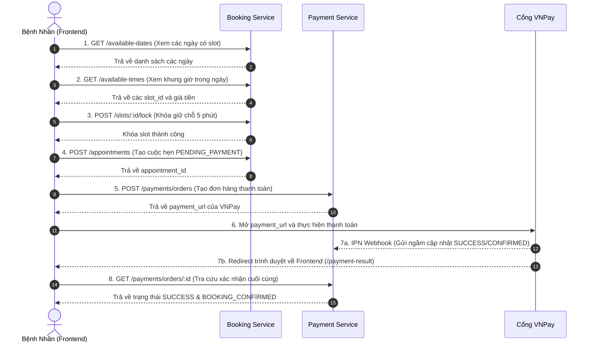

# HƯỚNG DẪN LUỒNG TÍCH HỢP ĐẶT LỊCH VÀ THANH TOÁN VNPAY (END-TO-END FLOW)

Tài liệu mô tả chi tiết toàn bộ chuỗi thao tác thực tế liên tục từ khi người dùng tìm kiếm lịch trống của Chuyên gia, giữ chỗ, tạo đơn hàng cho đến khi hoàn tất thanh toán VNPay và kiểm tra kết quả cuối cùng.

---

## 📌 QUY ƯỚC CHUNG

1. **Host API Backend (Staging)**: `https://api.qmcloud.io.vn`
2. **Host Frontend Web App (Staging)**: `https://qmcloud.io.vn`
3. **Quy định Headers**:
   - Mọi request yêu cầu đăng nhập cần truyền Header: `Authorization: Bearer <PATIENT_ACCESS_TOKEN>`
   - API Gateway (Kong) tự động trích xuất Token và gắn các Header định danh nội bộ:
     - `X-User-Id`: ID người dùng (`UUID`)
     - `X-User-Role`: `PATIENT` / `EXPERT` / `ADMIN`

---

## 🔐 Cấu hình tài khoản VNPay Sandbox

**URL Sandbox**: `https://sandbox.vnpayment.vn`

**Cấu hình tài khoản merchant (Cung cấp cho developer)**:

```
TMN Quốc tế:   MOCK_TMN
API Secret:     a1b2c3d4e5f6789012345678901234567890
Hash Secret:    a1b2c3d4e5f6789012345678901234567890
```

**Tài khoản ngân hàng Sandbox để testing**:

| Ngân hàng (Chọn trong form VNPay) | Số thẻ (Input)          | Tên chủ thẻ      | Ngày hết hạn (CVV/Expiry) | OTP (Input) |
| :-------------------------------- | :---------------------- | :--------------- | :------------------------ | :---------- |
| **NCB**                           | **9704198526191432198** | **NGUYEN VAN A** | **07/15**                 | **123456**  |

---

## 🔄 CHI TIẾT 8 BƯỚC THỰC THI THỰC TẾ



---

### 1️⃣ BƯỚC 1: Tìm các ngày có khung giờ trống của Chuyên gia

- **Mục đích**: Người dùng chọn Chuyên gia và khoảng ngày để xem chuyên gia đó trống vào những ngày nào.
- **HTTP Method**: `GET`
- **URL**: `/api/v1/public/booking/slots/available-dates?expert_id=2c230afb-a1af-4813-8b26-b17ae7fceb26&from=2026-07-23&to=2026-07-30&page=0&size=20`
- **Auth**: Không yêu cầu (Public)

📥 **Response Example (200 OK)**:

```json
{
  "success": true,
  "message": "Get available dates successfully",
  "data": {
    "expert_id": "2c230afb-a1af-4813-8b26-b17ae7fceb26",
    "items": ["2026-07-25", "2026-07-26"],
    "page": 0,
    "size": 20,
    "total_items": 2,
    "total_pages": 1,
    "has_next": false,
    "has_previous": false
  }
}
```

---

### 2️⃣ BƯỚC 2: Xem chi tiết các khung giờ trống của Ngày 2026-07-25

- **Mục đích**: Người dùng bấm chọn ngày `2026-07-25` để xem danh sách các slot giờ cụ thể.
- **HTTP Method**: `GET`
- **URL**: `/api/v1/public/booking/slots/available-times?expert_id=2c230afb-a1af-4813-8b26-b17ae7fceb26&date=2026-07-25&page=0&size=20`
- **Auth**: Không yêu cầu (Public)

📥 **Response Example (200 OK)**:

```json
{
  "success": true,
  "message": "Get available timeslots successfully",
  "data": {
    "expert_id": "2c230afb-a1af-4813-8b26-b17ae7fceb26",
    "date": "2026-07-25",
    "items": [
      {
        "slot_id": "3fa85f64-5717-4562-b3fc-2c963f66afa6",
        "price": 300000,
        "start_time": 1784944800000,
        "end_time": 1784948400000
      }
    ],
    "page": 0,
    "size": 20,
    "total_items": 1,
    "total_pages": 1,
    "has_next": false,
    "has_previous": false
  }
}
```

---

### 3️⃣ BƯỚC 3: Giữ chỗ tạm thời khung giờ (Lock Slot)

- **Mục đích**: Khóa tạm thời slot giờ `3fa85f64-5717-4562-b3fc-2c963f66afa6` trong 5 phút để tránh bị người dùng khác đặt trùng trong khi đang điền thông tin.
- **HTTP Method**: `POST`
- **URL**: `/api/v1/booking/slots/3fa85f64-5717-4562-b3fc-2c963f66afa6/lock`
- **Headers**:
  ```http
  Authorization: Bearer <PATIENT_ACCESS_TOKEN>
  X-User-Id: 11111111-1111-1111-1111-111111111111
  X-User-Role: PATIENT
  ```

📥 **Response Example (200 OK)**:

```json
{
  "success": true,
  "message": "Slot locked successfully",
  "data": {
    "slot_id": "3fa85f64-5717-4562-b3fc-2c963f66afa6",
    "locked_by": "11111111-1111-1111-1111-111111111111",
    "expires_at": 1784945400000
  }
}
```

---

### 4️⃣ BƯỚC 4: Tạo cuộc hẹn (Create Appointment)

- **Mục đích**: Điền lý do/ghi chú và chính thức khởi tạo cuộc hẹn trạng thái `PENDING_PAYMENT`.
- **HTTP Method**: `POST`
- **URL**: `/api/v1/booking/appointments`
- **Headers**:
  ```http
  Authorization: Bearer <PATIENT_ACCESS_TOKEN>
  X-User-Id: 11111111-1111-1111-1111-111111111111
  Content-Type: application/json
  ```
- **Request Body**:
  ```json
  {
    "slot_id": "3fa85f64-5717-4562-b3fc-2c963f66afa6",
    "notes": "Tư vấn tâm lý giảm căng thẳng học tập"
  }
  ```

📥 **Response Example (201 Created)**:

```json
{
  "success": true,
  "message": "Appointment created successfully",
  "data": {
    "id": "dddddddd-dddd-4ddd-8ddd-dddddddddddd",
    "expert_id": "2c230afb-a1af-4813-8b26-b17ae7fceb26",
    "patient_id": "11111111-1111-1111-1111-111111111111",
    "slot_id": "3fa85f64-5717-4562-b3fc-2c963f66afa6",
    "status": "PENDING_PAYMENT",
    "price": 300000,
    "notes": "Tư vấn tâm lý giảm căng thẳng học tập",
    "created_at": 1784944800000
  }
}
```

---

### 5️⃣ BƯỚC 5: Tạo Đơn hàng thanh toán lấy URL VNPay

- **Mục đích**: Gửi `appointment_id` sang Payment Service để tính phí, khấu trừ hoa hồng hệ thống và tạo đường link thanh toán VNPay Sandbox.
- **HTTP Method**: `POST`
- **URL**: `/api/v1/payments/orders`
- **Headers**:
  ```http
  Authorization: Bearer <PATIENT_ACCESS_TOKEN>
  X-User-Id: 11111111-1111-1111-1111-111111111111
  Content-Type: application/json
  ```
- **Request Body**:
  ```json
  {
    "appointment_id": "dddddddd-dddd-4ddd-8ddd-dddddddddddd"
  }
  ```

📥 **Response Example (200 OK)**:

```json
{
  "success": true,
  "message": "Payment order created successfully",
  "data": {
    "order_id": "ffffffff-ffff-4fff-8fff-ffffffffffff",
    "gross_amount": 300000,
    "net_amount": 255000,
    "commission_amount": 45000,
    "payment_url": "https://sandbox.vnpayment.vn/paymentv2/vpcpay.html?vnp_Amount=30000000&vnp_Command=pay&vnp_CreateDate=20260723220000&vnp_CurrCode=VND&vnp_IpAddr=127.0.0.1&vnp_Locale=vn&vnp_OrderInfo=Thanh+toan+lich+hen+dddddddd-dddd-4ddd-8ddd-dddddddddddd&vnp_OrderType=other&vnp_ReturnUrl=https%3A%2F%2Fqmcloud.io.vn%2Fpayment-result&vnp_TmnCode=MOCK_TMN&vnp_TxnRef=ffffffff-ffff-4fff-8fff-ffffffffffff&vnp_Version=2.1.0&vnp_SecureHash=a1b2c3d4e5f6...",
    "status": "PENDING",
    "expires_at": 1784945700000
  }
}
```

---

### 6️⃣ BƯỚC 6: Frontend chuyển hướng người dùng sang `payment_url`

- Frontend nhận `payment_url` ở Bước 5 và thực hiện redirect trình duyệt: `window.location.href = data.payment_url;`.
- Người dùng thao tác chọn thẻ Sandbox (Ví dụ chọn Ngân hàng `NCB`, số thẻ `9704198526191432198`, tên `NGUYEN VAN A`, CVV `07/15` OTP `123456`).

---

### 7️⃣ BƯỚC 7: VNPay xử lý Webhook IPN & Chuyển hướng người dùng về Frontend

1. **VNPay gọi ngầm Webhook Backend (Server-to-Server)**:
   - **URL**: `GET /api/v1/payments/vnpay-ipn?vnp_Amount=30000000&vnp_ResponseCode=00&vnp_TxnRef=ffffffff-ffff-4fff-8fff-ffffffffffff...`
   - **Xử lý Backend**: Kiểm tra checksum -> Cập nhật Order thành `SUCCESS` -> Cập nhật Appointment thành `CONFIRMED` -> Nạp tiền giữ (Hold) cho Ví chuyên gia.
2. **VNPay điều hướng trình duyệt Bệnh nhân (Browser Redirect)**:
   - **URL Frontend**: `GET https://qmcloud.io.vn/payment-result?vnp_ResponseCode=00&vnp_TxnRef=ffffffff-ffff-4fff-8fff-ffffffffffff`

---

### 8️⃣ BƯỚC 8: Frontend tra cứu chi tiết Đơn hàng & Hiển thị màn hình thành công

- **Mục đích**: Khi trình duyệt quay lại trang `/payment-result`, Frontend gọi API Backend để xác nhận trạng thái cuối cùng trong CSDL trước khi hiện UI thành công.
- **HTTP Method**: `GET`
- **URL**: `/api/v1/payments/orders/ffffffff-ffff-4fff-8fff-ffffffffffff`
- **Headers**:
  ```http
  Authorization: Bearer <PATIENT_ACCESS_TOKEN>
  X-User-Id: 11111111-1111-1111-1111-111111111111
  ```

📥 **Response Example (200 OK)**:

```json
{
  "success": true,
  "message": "Payment order retrieved successfully",
  "data": {
    "id": "ffffffff-ffff-4fff-8fff-ffffffffffff",
    "appointment_id": "dddddddd-dddd-4ddd-8ddd-dddddddddddd",
    "payer_id": "11111111-1111-1111-1111-111111111111",
    "amount_vnd": 300000,
    "status": "SUCCESS",
    "fulfillment_status": "BOOKING_CONFIRMED",
    "gateway": "VNPAY",
    "created_at": 1784944800000
  }
}
```

🎉 **GIAO DIỆN KẾT THÚC**: Frontend hiển thị popup/màn hình:

> **"Thanh toán 300,000 VNĐ thành công! Lịch hẹn của bạn đã được xác nhận thành công."**

---

## ⚙️ CẤU HÌNH BIẾN MÔI TRƯỜNG TRÊN SERVER STAGING

Trong file `.env` của `payment-service` trên Server Staging, cần cấu hình địa chỉ Return URL trỏ tới Frontend:

```env
VNP_TMN_CODE=MOCK_TMN
VNP_HASH_SECRET=MOCK_SECRET
VNP_PAYMENT_URL=https://sandbox.vnpayment.vn/paymentv2/vpcpay.html
VNP_RETURN_URL=https://qmcloud.io.vn/payment-result
```
