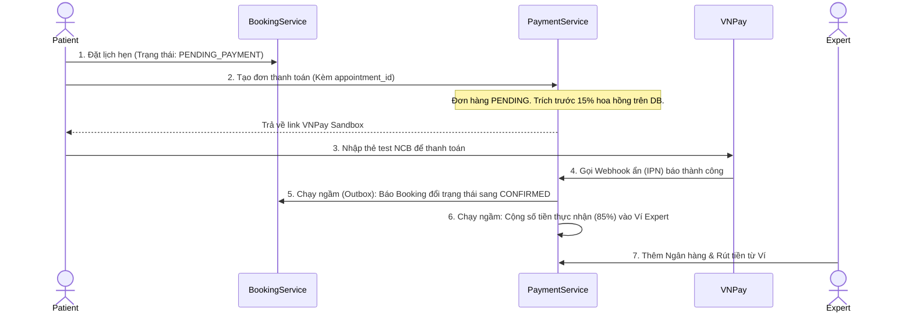

# 💳 HƯỚNG DẪN TEST TOÀN BỘ LUỒNG API PAYMENT & BOOKING (DÀNH CHO FE)

Tài liệu này cung cấp chi tiết toàn bộ luồng API, Payload (Request/Response) và giải thích các cơ chế chạy ngầm (Hoa hồng 15%, Đồng bộ trạng thái) giúp Frontend tích hợp và test dễ dàng nhất.

Mọi API đều đi qua **Kong API Gateway** tại `http://localhost:8000`. Cần truyền header xác thực:
`Authorization: Bearer <JWT_TOKEN>`

---

## 🗺️ TỔNG QUAN LUỒNG CHẠY (FLOWCHART)



---

## 🚀 PHẦN 1: LUỒNG CHÍNH ĐẶT LỊCH VÀ THANH TOÁN (PATIENT)

### Bước 1 — Khóa Slot tạm thời (15 phút)
Giữ chỗ trước khi tạo lịch để tránh người khác đặt trùng.
```http
POST http://localhost:8000/api/v1/booking/slots/<slot_id>/lock
Role: PATIENT
```
**Response (200 OK):**
```json
{
  "code": 200,
  "message": "Slot locked successfully for 15 minutes",
  "data": {
    "slot_id": "uuid-của-slot",
    "locked_until": 1720000900
  }
}
```

### Bước 2 — Tạo lịch hẹn
Chuyển Slot đã khóa thành một cuộc hẹn chờ thanh toán.
```http
POST http://localhost:8000/api/v1/booking/appointments
Role: PATIENT
```
**Request Body:**
```json
{
  "slot_id": "uuid-của-slot-ở-bước-1"
}
```
**Response (200 OK):**
```json
{
  "code": 200,
  "message": "Appointment created successfully!",
  "data": {
    "appointment_id": "uuid-của-lịch-hẹn",
    "status": "PENDING_PAYMENT",
    "expert_id": "uuid-của-expert",
    "slot_id": "uuid-của-slot"
  }
}
```
> ⚠️ **FE Lưu ý:** Lưu lại `appointment_id` để nạp vào API thanh toán bên dưới.

### Bước 3 — Tạo đơn hàng thanh toán VNPay
```http
POST http://localhost:8000/api/v1/payments/orders
Role: PATIENT
```
**Request Body:**
```json
{
  "payer_id": "uuid-của-patient",
  "expert_id": "uuid-của-expert",
  "amount": 200000,
  "gateway": "VNPAY",
  "appointment_id": "uuid-của-lịch-hẹn-ở-bước-2"
}
```
> 🕵️ **LUỒNG ẨN (Giải thích hệ thống):** Ngay khi tạo Order, hệ thống đã tính sẵn mức hoa hồng (Commission). Ví dụ `amount: 200,000đ` thì Hoa hồng 15% là `30,000đ`. Số tiền Thực nhận (Net Amount) Expert sẽ được hưởng là `170,000đ`.

**Response (200 OK):**
```json
{
  "code": 200,
  "message": "Payment order created successfully",
  "data": {
    "order_id": "uuid-đơn-hàng",
    "gross_amount": 200000,
    "commission_amount": 30000,
    "net_amount": 170000,
    "payment_url": "https://sandbox.vnpayment.vn/paymentv2/vpcpay.html?...",
    "status": "PENDING"
  }
}
```
> ⚠️ **FE Action:** Chuyển hướng (Redirect) người dùng sang `payment_url` để họ nhập thẻ.

### Bước 4 — Bảng thẻ Test cho VNPay Sandbox
Trên giao diện VNPay, chọn **"Thẻ nội địa và tài khoản ngân hàng"** -> Chọn ngân hàng **NCB**, và nhập đúng thông tin sau:

| Thông tin | Giá trị |
|-----------|---------|
| Ngân hàng | **NCB** |
| Số thẻ | `9704198526191432198` |
| Tên chủ thẻ | `NGUYEN VAN A` |
| Ngày phát hành | `07/15` |
| Mã OTP | `123456` |

### Bước 5 — Hệ thống xử lý ngầm sau khi thanh toán
Ngay sau khi nhập thẻ thành công, bạn không cần làm gì thêm, hệ thống Backend sẽ chạy ngầm các bước sau trong chưa tới 2 giây:
1. **IPN Webhook:** VNPay bắn tín hiệu báo thanh toán thành công về Backend.
2. **Cộng tiền Ví Expert:** Số tiền `net_amount` (ví dụ 170,000đ) lập tức được cộng vào `available_balance` của Expert. Số dư của Patient giữ nguyên (vì họ trả bằng tiền thẻ ngân hàng bên ngoài).
3. **Đồng bộ Lịch hẹn (Outbox Pattern):** Payment Service tự động gọi Booking Service để đổi trạng thái Lịch hẹn sang `CONFIRMED`.

**FE có thể gọi lại API Booking để kiểm chứng:**
`GET /api/v1/booking/appointments` -> Kiểm tra xem lịch hẹn đã chuyển sang `CONFIRMED` chưa.

---

## 💰 PHẦN 2: LUỒNG QUẢN LÝ VÍ & RÚT TIỀN (EXPERT)

### 2.1 - Xem số dư ví
```http
GET http://localhost:8000/api/v1/payments/wallets/me
Role: EXPERT
```
**Response (200 OK):**
```json
{
  "code": 200,
  "message": "Wallet retrieved successfully",
  "data": {
    "id": "uuid-của-ví",
    "user_id": "uuid-của-expert",
    "available_balance": 170000,
    "pending_balance": 0,
    "locked_balance": 0,
    "created_at": 1720000000
  }
}
```

### 2.2 - (Dành cho Tester) Nạp tiền nhanh
Dùng để bơm tiền trực tiếp vào ví Expert để test luồng rút tiền nhanh mà không cần tạo lịch hẹn.
```http
POST http://localhost:8000/api/v1/payments/wallets/top-up
Role: EXPERT
```
**Request Body:**
```json
{
  "amount": 10000000
}
```

### 2.3 - Liên kết tài khoản ngân hàng
```http
POST http://localhost:8000/api/v1/payments/bank-accounts
Role: EXPERT
```
**Request Body:**
```json
{
  "bank_code": "Vietcombank",
  "account_number": "1011223344",
  "account_holder_name": "NGUYEN VAN B"
}
```
> 🛠 **LƯU Ý TEST MOCK:** Hiện tại API đang bật chế độ giả lập check tên ngân hàng. 
> Nếu bạn nhập `account_number` là `"1011223344"`, bắt buộc `account_holder_name` phải nhập chính xác là `"NGUYEN VAN B"`. Nếu sai tên sẽ báo lỗi ngay lập tức. Các số tài khoản khác sẽ auto pass.

### 2.4 - Tạo Yêu cầu Rút tiền
```http
POST http://localhost:8000/api/v1/payments/withdrawals
Role: EXPERT
```
**Request Body:**
```json
{
  "bank_account_id": "uuid-ngân-hàng-đã-liên-kết-bên-trên",
  "amount": 2500000
}
```

> 🕵️ **CƠ CHẾ XÉT DUYỆT RÚT TIỀN (ẨN):**
> * **Nếu Rút < 5,000,000 VNĐ:** Phiếu rút tự động được **APPROVED** (Duyệt). Số dư bị trừ ngay. Hàm giả lập ngân hàng sẽ chạy ngầm và báo hoàn tất (`COMPLETED`) sau 2 giây.
> * **Nếu Rút >= 5,000,000 VNĐ:** Phiếu rút bị treo ở trạng thái **PENDING_APPROVAL** (Chờ duyệt). Số tiền trong ví bị khóa (`locked_balance`). Chuyển sang Bước 3 để Admin duyệt.

---

## 🛡️ PHẦN 3: LUỒNG DUYỆT RÚT TIỀN (ADMIN)
*(Chỉ dùng khi Expert rút tiền >= 5.000.000 VNĐ)*

### Phê duyệt lệnh rút
```http
POST http://localhost:8000/api/v1/payments/withdrawals/:id/approve
Role: ADMIN
```
- `:id` là ID của Withdrawal request
- **Kết quả:** Trạng thái chuyển thành `APPROVED`. Số tiền bị khóa được giải ngân và gửi lệnh rút ra ngân hàng (Mock sau 2 giây sẽ báo `COMPLETED`).

### Từ chối lệnh rút
```http
POST http://localhost:8000/api/v1/payments/withdrawals/:id/reject
Role: ADMIN
```
- **Kết quả:** Trạng thái chuyển thành `REJECTED`. Số tiền bị khóa được hoàn trả lại vào `available_balance` của Expert.
