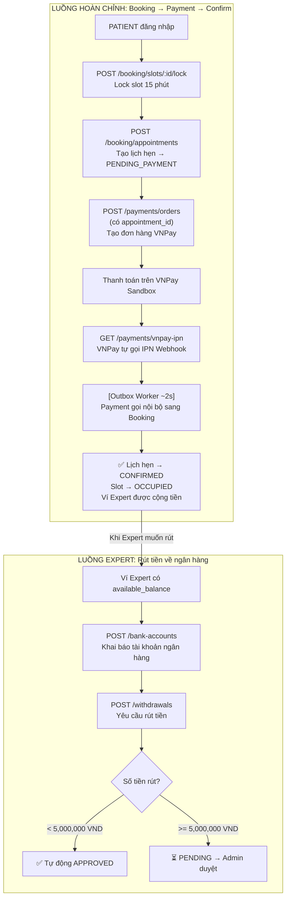

# 💳 HƯỚNG DẪN TEST TOÀN BỘ LUỒNG API PAYMENT SERVICE

Hệ thống thanh toán gồm **4 mảng nghiệp vụ** liên kết với nhau:

| # | Nhóm | Mô tả |
|---|------|--------|
| 1 | **Ví điện tử (Wallets)** | Xem số dư, nạp tiền nhanh (Dev), xem lịch sử giao dịch |
| 2 | **Đặt lịch → Thanh toán (Full Flow)** | Booking → tạo order → VNPay Sandbox → tự động CONFIRMED |
| 3 | **Rút tiền (Withdrawals)** | Liên kết ngân hàng → tạo phiếu rút → Admin duyệt/từ chối |
| 4 | **Nạp tiền thủ công (Dev only)** | Nạp thẳng vào ví không qua cổng thanh toán |

---

## 🗺️ Sơ đồ luồng tiền đầy đủ



---

## 🔑 Yêu cầu chung trước khi test

- Mọi API đều đi qua **Kong API Gateway** tại `http://localhost:8000`
- Các API Private yêu cầu header JWT token:
  ```
  Authorization: Bearer <JWT_TOKEN>
  ```
- Lấy token bằng cách đăng nhập qua `POST /api/v1/auth/login` với tài khoản tương ứng Role cần test.

---

## 🚀 LUỒNG CHÍNH: Đặt lịch → Thanh toán → Xác nhận tự động

> Đây là luồng đầy đủ mới nhất, test được toàn bộ kết nối Payment ↔ Booking.

### Bước 1 — PATIENT lock slot (15 phút)

```
POST http://localhost:8000/api/v1/booking/slots/<slot_id>/lock
Role: PATIENT
```

**Response mẫu:**
```json
{
  "code": 200,
  "message": "Slot locked successfully for 15 minutes",
  "data": {
    "slot_id": "uuid-của-slot",
    "locked_until": 1720000900
  }
}
```

---

### Bước 2 — PATIENT tạo lịch hẹn

```
POST http://localhost:8000/api/v1/booking/appointments
Role: PATIENT
```

**Body:**
```json
{
  "slot_id": "uuid-của-slot-vừa-lock"
}
```

**Response mẫu:**
```json
{
  "code": 200,
  "message": "Appointment created successfully! Please complete payment within 15 minutes.",
  "data": {
    "appointment_id": "uuid-của-lịch-hẹn",
    "status": "PENDING_PAYMENT",
    "expert_id": "uuid-của-expert",
    "slot_id": "uuid-của-slot"
  }
}
```

> ⚠️ **Lưu lại `appointment_id`** — cần dùng ở bước tiếp theo.

---

### Bước 3 — PATIENT tạo đơn hàng thanh toán (CÓ appointment_id)

```
POST http://localhost:8000/api/v1/payments/orders
Role: PATIENT
```

**Body:**
```json
{
  "payer_id": "uuid-của-patient",
  "expert_id": "uuid-của-expert",
  "amount": 200000,
  "gateway": "VNPAY",
  "appointment_id": "uuid-của-lịch-hẹn-ở-bước-2"
}
```

> 💡 `appointment_id` là trường **mới** — giúp Payment Service biết phải confirm lịch hẹn nào sau khi thanh toán xong.

**Response mẫu:**
```json
{
  "code": 200,
  "data": {
    "order_id": "uuid-đơn-hàng",
    "gross_amount": 200000,
    "commission_amount": 30000,
    "net_amount": 170000,
    "payment_url": "https://sandbox.vnpayment.vn/paymentv2/vpcpay.html?...",
    "status": "PENDING"
  }
}
```

> ⚠️ **Copy `payment_url`** — dán vào trình duyệt để thanh toán ở bước tiếp theo.

---

### Bước 4 — Thanh toán trên trang VNPay Sandbox (Trình duyệt)

1. Dán `payment_url` vào thanh địa chỉ trình duyệt.
2. Chọn **"Thẻ nội địa và tài khoản ngân hàng"**.
3. Chọn ngân hàng **NCB**.
4. Nhập thông tin thẻ test:

| Trường | Giá trị |
|--------|---------:|
| Số thẻ | `9704198526191432198` |
| Tên chủ thẻ | `NGUYEN VAN A` |
| Ngày phát hành | `07/15` |
| Mã OTP | `123456` |

5. Bấm **Xác nhận thanh toán**.

---

### Bước 5 — Chờ Outbox Worker (~2 giây) và kiểm tra kết quả

Sau khi thanh toán thành công, luồng tự động diễn ra:

```
VNPay → IPN → Payment Service (cập nhật order SUCCESS + lưu outbox event)
                                    ↓ (Outbox Worker quét mỗi 2 giây)
                         Booking Service nhận internal call
                                    ↓
                  Lịch hẹn: PENDING_PAYMENT → CONFIRMED ✅
                  Slot: LOCKED → OCCUPIED ✅
                  Ví Expert: cộng 170,000 VND (sau khi trừ 15% hoa hồng) ✅
```

**Kiểm tra lịch hẹn đã CONFIRMED chưa:**
```
GET http://localhost:8000/api/v1/booking/appointments
Role: PATIENT
```

**Kiểm tra ví Expert đã được cộng tiền chưa:**
```
GET http://localhost:8000/api/v1/payments/wallets/me
Role: EXPERT
```

---

## 1️⃣ Luồng phụ: Quản lý ví điện tử (PATIENT / EXPERT)

### API — Xem thông tin ví
```
GET http://localhost:8000/api/v1/payments/wallets/me
Role: PATIENT | EXPERT
```

**Response mẫu (ví mới — sẽ tự tạo nếu chưa tồn tại):**
```json
{
  "code": 200,
  "message": "Wallet retrieved successfully",
  "data": {
    "id": "uuid-của-ví",
    "user_id": "uuid-của-bạn",
    "available_balance": 0,
    "pending_balance": 0,
    "locked_balance": 0,
    "created_at": 1720000000
  }
}
```

---

### API — Nạp tiền nhanh ⚡ (Dev/Test only — không qua VNPay)
```
POST http://localhost:8000/api/v1/payments/wallets/top-up
Role: PATIENT | EXPERT
```

**Body:**
```json
{
  "amount": 1000000
}
```

> **Dùng khi nào?** Dùng API này để nạp tiền thẳng vào ví mà không cần qua VNPay. Thích hợp để test nhanh luồng rút tiền.

---

### API — Xem lịch sử giao dịch ví
```
GET http://localhost:8000/api/v1/payments/wallets/history
Role: PATIENT | EXPERT
```

---

## 2️⃣ Luồng phụ: Liên kết ngân hàng & Rút tiền (EXPERT)

> Trước tiên Expert cần có `available_balance > 0`. Dùng API top-up hoặc hoàn thành luồng chính ở trên.

### API — Liên kết tài khoản ngân hàng
```
POST http://localhost:8000/api/v1/payments/bank-accounts
Role: EXPERT
```

**Body:**
```json
{
  "bank_name": "Vietcombank",
  "account_number": "1011223344",
  "account_holder": "NGUYEN VAN B"
}
```

---

### API — Lấy danh sách ngân hàng đã liên kết
```
GET http://localhost:8000/api/v1/payments/bank-accounts
Role: EXPERT
```

---

### API — Yêu cầu rút tiền
```
POST http://localhost:8000/api/v1/payments/withdrawals
Role: EXPERT
```

**Body:**
```json
{
  "bank_account_id": "uuid-của-tài-khoản-ngân-hàng",
  "amount": 2500000
}
```

**Quy tắc xét duyệt tự động:**

| Điều kiện | Kết quả |
|-----------|---------|
| Số tiền **< 5,000,000 VND** | ✅ Tự động **APPROVED** — Trừ tiền ví ngay lập tức |
| Số tiền **≥ 5,000,000 VND** | ⏳ Trạng thái **PENDING** — Tiền bị khóa, chờ Admin duyệt |

---

## 3️⃣ Luồng phụ: Admin xét duyệt rút tiền (ADMIN)

> Chỉ áp dụng cho phiếu rút ≥ 5,000,000 VND đang ở trạng thái `PENDING`.

### API — Phê duyệt yêu cầu rút tiền
```
POST http://localhost:8000/api/v1/payments/withdrawals/:id/approve
Role: ADMIN
```

- `:id` = Withdrawal ID nhận được từ API tạo rút tiền
- **Kết quả:** Phiếu rút chuyển sang `APPROVED`, tiền trong `locked_balance` được giải ngân.

---

### API — Từ chối yêu cầu rút tiền
```
POST http://localhost:8000/api/v1/payments/withdrawals/:id/reject
Role: ADMIN
```

- `:id` = Withdrawal ID nhận được từ API tạo rút tiền
- **Kết quả:** Phiếu rút chuyển sang `REJECTED`, tiền đang bị khóa được **hoàn trả** về `available_balance` của Expert.

---

## 🧪 Checklist tự test nhanh (5 phút)

```
[ ] 1. Đăng nhập PATIENT → lấy JWT
[ ] 2. GET /booking/slots → tìm slot available
[ ] 3. POST /booking/slots/:id/lock → lock slot
[ ] 4. POST /booking/appointments → tạo lịch → lưu appointment_id
[ ] 5. POST /payments/orders (có appointment_id) → lấy payment_url
[ ] 6. Mở payment_url trên trình duyệt → điền thẻ test NCB → xác nhận
[ ] 7. Chờ ~5 giây
[ ] 8. GET /booking/appointments → kiểm tra status = "CONFIRMED" ✅
[ ] 9. Đăng nhập EXPERT → GET /payments/wallets/me → kiểm tra pending_balance tăng ✅
```
