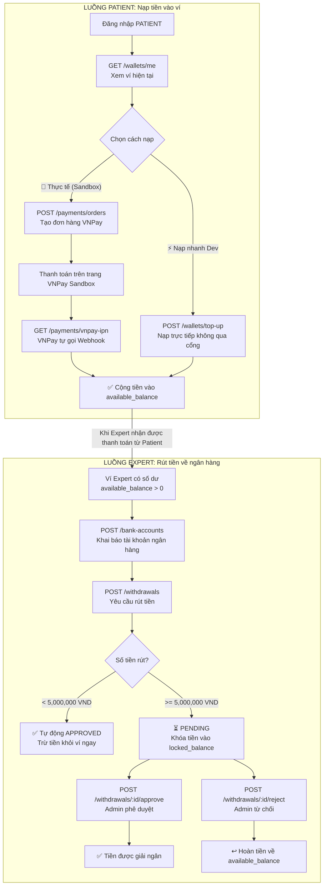

# 💳 HƯỚNG DẪN TEST TOÀN BỘ LUỒNG API PAYMENT SERVICE

Hệ thống thanh toán gồm **3 mảng nghiệp vụ** liên kết với nhau:

| # | Nhóm | Mô tả |
|---|------|--------|
| 1 | **Ví điện tử (Wallets)** | Xem số dư, nạp tiền nhanh (Dev), xem lịch sử giao dịch |
| 2 | **Cổng thanh toán (VNPay)** | Tạo đơn hàng → thanh toán Sandbox → nhận Webhook IPN |
| 3 | **Rút tiền (Withdrawals)** | Liên kết ngân hàng → tạo phiếu rút → Admin duyệt/từ chối |

---

## 🗺️ Sơ đồ luồng tiền trong hệ thống



---

## 🔑 Yêu cầu chung trước khi test

- Mọi API đều đi qua **Kong API Gateway** tại `http://localhost:8000`
- Các API Private yêu cầu header JWT token:
  ```
  Authorization: Bearer <JWT_TOKEN>
  ```
- Lấy token bằng cách đăng nhập qua `POST /api/v1/auth/login` với tài khoản tương ứng Role cần test.

---

## 1️⃣ Luồng 1: Quản lý ví điện tử (PATIENT / EXPERT)

### API 1 — Xem thông tin ví
```
GET http://localhost:8000/api/v1/payments/wallets/me
Role: PATIENT | EXPERT
```

**Response mẫu (ví mới — sẽ tự tạo nếu chưa tồn tại):**
```json
{
  "code": 200,
  "message": "Wallet retrieved successfully",
  "data": {
    "id": "uuid-của-ví",
    "user_id": "uuid-của-bạn",
    "available_balance": 0,
    "locked_balance": 0,
    "created_at": 1720000000
  }
}
```

---

### API 2 — Nạp tiền nhanh ⚡ (Chỉ dùng khi Dev/Test)
```
POST http://localhost:8000/api/v1/payments/wallets/top-up
Role: PATIENT | EXPERT
```

**Body:**
```json
{
  "amount": 1000000
}
```

> **Dùng khi nào?** Dùng API này để nạp tiền thẳng vào ví mà không cần qua cổng VNPay. Thích hợp để test nhanh luồng rút tiền mà không cần mở trình duyệt.

---

### API 3 — Xem lịch sử giao dịch ví
```
GET http://localhost:8000/api/v1/payments/wallets/history
Role: PATIENT | EXPERT
```

**Response mẫu:**
```json
{
  "code": 200,
  "message": "Transaction history retrieved successfully",
  "data": [
    {
      "id": "uuid-giao-dịch",
      "wallet_id": "uuid-ví",
      "type": "CREDIT",
      "amount": 1000000,
      "balance_after": 1000000,
      "reference_type": "MANUAL",
      "created_at": 1720000000
    }
  ]
}
```

---

## 2️⃣ Luồng 2: Thanh toán qua VNPay Sandbox (PATIENT)

### API 4 — Tạo đơn hàng thanh toán
```
POST http://localhost:8000/api/v1/payments/orders
Role: PATIENT
```

**Body:**
```json
{
  "payer_id": "uuid-của-patient",
  "expert_id": "uuid-của-expert",
  "amount": 200000,
  "gateway": "VNPAY"
}
```

**Response:** Trả về `payment_url` → Copy link này dán vào trình duyệt để mở trang thanh toán.

---

### Bước 5 — Thanh toán trên trang VNPay Sandbox (Trình duyệt)

1. Dán `payment_url` vào thanh địa chỉ trình duyệt.
2. Chọn **"Thẻ nội địa và tài khoản ngân hàng"**.
3. Chọn ngân hàng **NCB**.
4. Nhập thông tin thẻ test:

| Trường | Giá trị |
|--------|---------|
| Số thẻ | `9704198526191432198` |
| Tên chủ thẻ | `NGUYEN VAN A` |
| Ngày phát hành | `07/15` |
| Mã OTP | `123456` |

---

### API 6 — Webhook IPN (VNPay tự gọi, không cần gọi thủ công)
```
GET http://localhost:8000/api/v1/payments/vnpay-ipn
Role: PUBLIC (không cần token)
```

> VNPay Sandbox sẽ tự động gọi URL này sau khi thanh toán hoàn tất.  
> Kết quả thành công: Đơn hàng chuyển trạng thái thành `SUCCESS`, số dư ví Expert tăng lên.

---

## 3️⃣ Luồng 3: Liên kết ngân hàng & Rút tiền (EXPERT)

### API 7 — Liên kết tài khoản ngân hàng
```
POST http://localhost:8000/api/v1/payments/bank-accounts
Role: EXPERT
```

**Body:**
```json
{
  "bank_name": "Vietcombank",
  "account_number": "1011223344",
  "account_holder": "NGUYEN VAN B"
}
```

---

### API 8 — Lấy danh sách ngân hàng đã liên kết
```
GET http://localhost:8000/api/v1/payments/bank-accounts
Role: EXPERT
```

---

### API 9 — Yêu cầu rút tiền
```
POST http://localhost:8000/api/v1/payments/withdrawals
Role: EXPERT
```

**Body:**
```json
{
  "bank_account_id": "uuid-của-tài-khoản-ngân-hàng-ở-API-7",
  "amount": 2500000
}
```

**Quy tắc xét duyệt tự động:**

| Điều kiện | Kết quả |
|-----------|---------|
| Số tiền **< 5,000,000 VND** | ✅ Tự động **APPROVED** — Trừ tiền ví ngay lập tức |
| Số tiền **≥ 5,000,000 VND** | ⏳ Trạng thái **PENDING** — Tiền bị khóa vào `locked_balance`, chờ Admin duyệt |

---

## 4️⃣ Luồng 4: Admin xét duyệt rút tiền (ADMIN)

> Chỉ áp dụng cho các phiếu rút tiền ≥ 5,000,000 VND đang ở trạng thái `PENDING`.

### API 10 — Phê duyệt yêu cầu rút tiền
```
POST http://localhost:8000/api/v1/payments/withdrawals/:id/approve
Role: ADMIN
```

- `:id` = Withdrawal ID nhận được ở API 9
- **Kết quả:** Phiếu rút chuyển sang `APPROVED`, số tiền trong `locked_balance` được giải ngân.

---

### API 11 — Từ chối yêu cầu rút tiền
```
POST http://localhost:8000/api/v1/payments/withdrawals/:id/reject
Role: ADMIN
```

- `:id` = Withdrawal ID nhận được ở API 9
- **Kết quả:** Phiếu rút chuyển sang `REJECTED`, số tiền đang bị khóa được **hoàn trả ngược** về `available_balance` của Expert.
