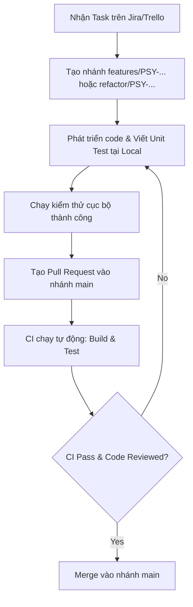

# Quy trình Làm việc (Workflow Convention)

Tài liệu này hướng dẫn chi tiết quy trình phát triển tính năng, kiểm thử, đánh giá mã nguồn (code review) và triển khai (deployment) cho dự án **MindCare**.

---

## 1. Luồng Phát triển Tính năng (Feature Development Lifecycle)



### Bước 1: Khởi đầu công việc

- Nhận nhiệm vụ từ bảng công việc (Jira/Trello), xác định rõ **Task ID** (Ví dụ: `PSY-201`).
- Tạo nhánh mới từ nhánh `main` mới nhất:
  ```bash
  git checkout main
  git pull origin main
  git checkout -b features/PSY-201-add-user-rating
  ```

### Bước 2: Phát triển code cục bộ (Local Development)

- Viết mã nguồn tuân thủ [Code Convention](code-convention.md).
- Thực hiện commit đều đặn tuân thủ [Git Convention](git-convention.md).

### Bước 3: Tạo Pull Request (PR) & Tích hợp (CI)

- Đẩy nhánh lên remote repository và tạo Pull Request (PR) trỏ vào nhánh `main`.
- Quy trình CI **Build and Test** sẽ tự động kích hoạt:
  - Biên dịch mã nguồn Frontend và các Backend service.
  - Chạy toàn bộ suite Unit Test để phát hiện sớm lỗi.
- _Lưu ý_: Pull Request chỉ được chấp nhận merge khi toàn bộ job CI chuyển màu xanh lá cây (Passed) và được tối thiểu 1 thành viên phê duyệt (Approved).

---

## 2. Luồng Triển khai Kiểm thử (Staging / Sandbox Deployment)

- Sau khi các tính năng tích hợp thành công trên nhánh `main`, các tính năng sẵn sàng để deploy lên môi trường Staging.
- Tạo PR từ nhánh `main` sang nhánh `staging`.
- Khi PR sang `staging` được chấp nhận, hệ thống CI/CD (`deploy-staging.yml`) tự động:
  - Tải mã nguồn mới nhất của staging.
  - Tải và chạy các container DB, Redis, RabbitMQ thông qua Docker Compose.
  - Build các Docker image mới nhất và khởi động lại sandbox server.
- Đội ngũ QA/Tester sẽ tiến hành kiểm thử chức năng (Manual/Automation testing) trực tiếp trên môi trường sandbox này.

---

## 3. Luồng Triển khai Thực tế (Production Deployment)

- Khi phiên bản trên nhánh `staging` đã hoạt động ổn định và vượt qua mọi bài kiểm tra của QA.
- Tạo PR từ nhánh `staging` sang nhánh `product`.
- Thực hiện triển khai mã nguồn lên Product Server (Production). Chỉ Leader hoặc DevOps Engineer mới có quyền merge vào nhánh `product`.
